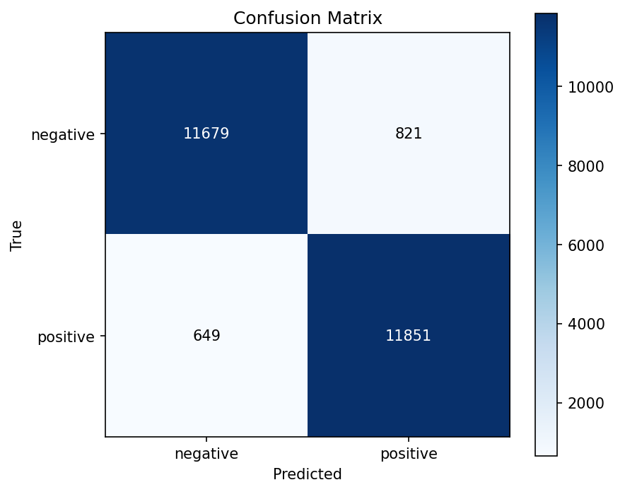

# IMDb Sentiment Classification with RoBERTa

Fine-tuning [RoBERTa-base](https://huggingface.co/roberta-base) on the IMDb movie reviews dataset for binary sentiment classification (positive / negative), reaching **94.12% accuracy** on the held-out test set of 25,000 reviews.

---

## Results



| Metric            | Value  |
|-------------------|--------|
| Test Accuracy     | 94.12% |
| Macro F1          | 0.9412 |
| Negative F1       | 0.9408 |
| Positive F1       | 0.9416 |

Per-class metrics on the test set (25,000 reviews):

| Class    | Precision | Recall | F1     |
|----------|-----------|--------|--------|
| negative | 0.9474    | 0.9343 | 0.9408 |
| positive | 0.9352    | 0.9481 | 0.9416 |

---

## Project Structure

```
imdb-roberta-sentiment/
├── checkpoints/           # Fine-tuned model checkpoints (git-ignored)
├── logs/                  # TensorBoard logs (git-ignored)
├── results/               # Evaluation artifacts (git-ignored)
├── docs/
│   └── images/            # Figures showcased in this README
├── src/
│   ├── data.py            # Tokenization & dataloaders
│   ├── model.py           # RoBERTa builder
│   ├── training.py        # Training & validation loops
│   ├── evaluation.py      # Metrics & confusion matrix
│   ├── inference.py       # Single-text prediction
│   └── utils.py           # Seed, device, logger, config loader
├── configs/
│   └── config.yaml        # All hyperparameters
├── train.py               # Entry point: fine-tuning
├── evaluate.py            # Entry point: test-set evaluation
├── predict.py             # Entry point: CLI inference on raw text
└── requirements.txt
```
---

## Setup

**1. Clone the repository**
```bash
git clone https://github.com/Nestallum/imdb-roberta-sentiment.git
cd imdb-roberta-sentiment
```

**2. Create and activate a virtual environment**
```bash
python -m venv .venv
.venv\Scripts\activate      # Windows
source .venv/bin/activate   # macOS/Linux
```

**3. Install dependencies**
```bash
pip install torch torchvision --index-url https://download.pytorch.org/whl/cu130
pip install -r requirements.txt
```

The `cu130` index targets PyTorch with CUDA 13.0 support, required for NVIDIA Blackwell GPUs (RTX 50 series, sm_120). Adjust to your hardware if needed (see [PyTorch installation guide](https://pytorch.org/get-started/locally/)).

---

## Usage

**Fine-tune RoBERTa**
```bash
python train.py --config configs/config.yaml
```

The IMDb dataset (~80 MB) is downloaded automatically on first run. Training takes ~12 minutes for 3 epochs on an RTX 5070.

**Evaluate on the test set**
```bash
python evaluate.py --config configs/config.yaml --checkpoint checkpoints/best
```

Generates a classification report and the confusion matrix shown above.

**Predict on raw text**
```bash
python predict.py --text "This movie was absolutely incredible."
# Prediction: positive (0.9986)
```

**Monitor training with TensorBoard**
```bash
tensorboard --logdir logs/
```

Then open [http://localhost:6006](http://localhost:6006).

---

## Model Architecture

[RoBERTa-base](https://arxiv.org/abs/1907.11692) (Liu et al., 2019) is a robustly optimized variant of BERT, sharing the same 12-layer encoder-only Transformer backbone (~125M parameters, 768 hidden dim, 12 attention heads) but trained on more data with a refined protocol (dynamic masking, no next-sentence prediction, larger batches).

For sentiment classification, a small two-layer head (`Linear(768→768) + tanh + Linear(768→2)`) is added on top of the `<s>` token's final hidden state. The full model is fine-tuned end-to-end: backbone weights are not frozen.

The pre-trained backbone already encodes rich linguistic representations from ~160 GB of text. Fine-tuning adapts these representations to the binary sentiment task with a small learning rate (2e-5) over a few epochs, avoiding catastrophic forgetting of the pre-trained knowledge.

---

## Configuration

All hyperparameters are centralized in `configs/config.yaml`. No need to touch the source code to run experiments.

Key parameters:

| Parameter         | Value                              |
|-------------------|------------------------------------|
| Model             | RoBERTa-base (~125M params)        |
| Max sequence length | 256 tokens                       |
| Epochs            | 3                                  |
| Batch size        | 32                                 |
| Optimizer         | AdamW                              |
| Learning rate     | 2e-5                               |
| Weight decay      | 0.01                               |
| Scheduler         | Linear warmup (10%) + linear decay |
| Gradient clipping | 1.0                                |

These values follow the standard fine-tuning recipe from the BERT/RoBERTa papers and HuggingFace examples.

---

## Dataset

[IMDb](https://ai.stanford.edu/~amaas/data/sentiment/) (Maas et al., 2011) — 50,000 movie reviews split evenly into 25k train / 25k test, balanced across positive and negative classes. Reviews with neutral ratings (5–6 / 10) are excluded from the dataset by construction, making this strictly a binary classification benchmark.

A 10% validation split is carved out of the training set (stratified by label) to monitor overfitting; the test set remains untouched until final evaluation.

| Split      | Size   |
|------------|--------|
| Train      | 22,500 |
| Validation | 2,500  |
| Test       | 25,000 |

---

## On Calibration and Ambiguity

The fine-tuned model produces overconfident predictions (~99% probability) even on genuinely ambiguous inputs. For instance, the review *"The film tries hard but never quite delivers. Some scenes are brilliant, others fall completely flat."* is classified as negative with 99.7% confidence — a level of certainty inconsistent with the input's evident ambiguity.

This is not a bug but a structural limitation. Temperature scaling (Guo et al., 2017), the standard post-hoc calibration method, can flatten predicted probabilities but cannot give the model the ability to express genuine uncertainty. The deeper cause is architectural: the model was trained on strictly binary labels (0 / 1) over a dataset that excludes neutral reviews by construction. It has never been exposed to the concept of an "in-between" sentiment.

Achieving truly nuanced predictions would require revisiting the training procedure:

- **Label smoothing**: replacing hard 0/1 targets with 0.05/0.95, forcing the model to retain residual doubt.
- **Mixup on embeddings**: synthesizing intermediate examples by interpolating between positive and negative reviews.
- **Switching dataset**: training on a graded sentiment corpus such as SST-5 or Yelp 5-star, where the label space natively encodes ambiguity.
- **Multi-task learning**: adding an explicit uncertainty regularization objective.

All these approaches require retraining; no post-hoc fix can substitute for representations the model never learned.

---

## Future Improvements

The current model achieves 94.12% test accuracy. Pushing toward state-of-the-art (~95.5% with RoBERTa-base, ~96% with RoBERTa-large) would involve:

- **Longer sequences**: increasing `max_length` from 256 to 512 captures more context at the cost of ~4× slower training.
- **Hyperparameter tuning**: grid search over learning rate, batch size, and number of epochs.
- **Multiple seeds + averaging**: training 3–5 models with different seeds and averaging predictions typically adds ~0.3% accuracy.
- **Larger backbone**: switching to RoBERTa-large would add ~1–1.5% but tripling parameter count and compute.

---

## References

- Liu, Y. et al. (2019). [RoBERTa: A Robustly Optimized BERT Pretraining Approach](https://arxiv.org/abs/1907.11692).
- Devlin, J. et al. (2019). [BERT: Pre-training of Deep Bidirectional Transformers for Language Understanding](https://arxiv.org/abs/1810.04805).
- Maas, A. L. et al. (2011). [Learning Word Vectors for Sentiment Analysis](https://aclanthology.org/P11-1015/). ACL.

---

## License

MIT — see [LICENSE](LICENSE).